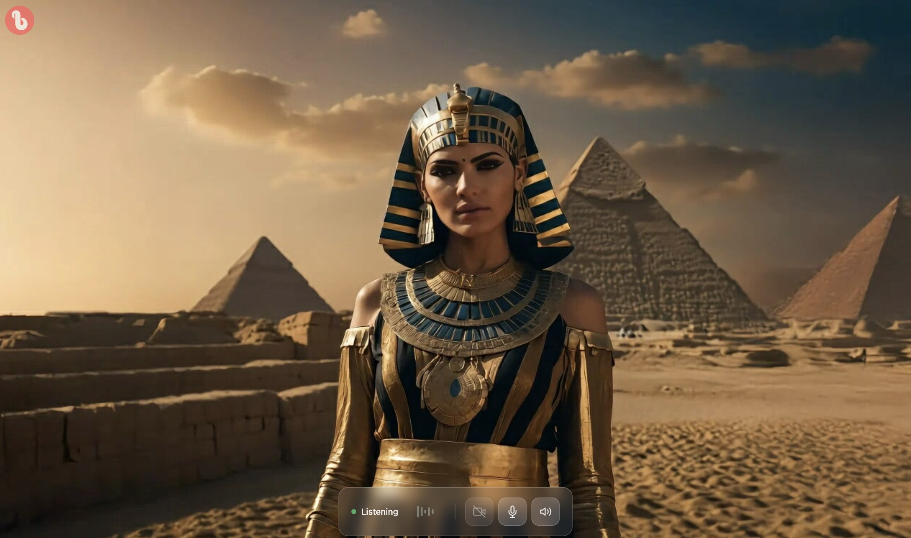

# nextjs-ui — a web front end for a LiveKit avatar agent

A Next.js app that joins a LiveKit room and shows your bitHuman avatar agent: the
avatar's video, your microphone and camera controls, and a voice-activity indicator.
Your agent runs elsewhere — for example [`python/cloud-essence/`](../../python/cloud-essence/)
(a bitHuman cloud avatar) or [`python/self-host/`](../../python/self-host/) (the avatar
rendered on your own machine). This app only connects a browser to that room.



For a web page that needs no LiveKit setup at all, use the one-iframe embed instead:
[Web](https://docs.bithuman.ai/platforms/web).

## What you need

- Node.js 18 or newer and npm.
- A LiveKit server: [LiveKit Cloud](https://livekit.io/cloud) or your own.
- A LiveKit agent that publishes the avatar, such as one of the Python examples above.
  Those need a bitHuman API secret (Creator plan or higher from 12 October 2026); this
  front end does not.

## Run it

```bash
git clone https://github.com/bithuman-product/bithuman-examples.git
cd bithuman-examples/integrations/nextjs-ui
npm install
cp env.template .env      # then fill in the LiveKit values below
npm run dev               # http://localhost:3000
```

## Configuration

`.env` (see `env.template`):

```env
# The LiveKit URL the browser connects to
NEXT_PUBLIC_LIVEKIT_URL=wss://your-livekit-server.com

# Used by /api/token to mint the browser's LiveKit access token
LIVEKIT_API_KEY=your-api-key
LIVEKIT_API_SECRET=your-api-secret

# Frontend settings (JSON)
NEXT_PUBLIC_APP_CONFIG={}

# Optional — read by server.js and /api/token when the app runs behind a docker-compose stack
LIVEKIT_WS_URL=http://livekit:17880     # internal LiveKit URL
PORT=3000                               # Next.js listen port
BITHUMAN_AVATAR_IMAGE=                  # avatar background image URL
```

The LiveKit API secret stays on the server: `/api/token` uses it to mint the browser's
access token, and the browser never sees it. No bitHuman credential belongs in
this app.

For `npm run dev` and `npm start`, `PORT`, `LIVEKIT_WS_URL` and `BITHUMAN_AVATAR_IMAGE`
default to `3000`, the LiveKit container's internal URL, and empty.

## Project structure

```
src/
  components/
    playground/     the video and controls
    connection/     connection management
    toast/          notifications
  contexts/         React contexts
  hooks/            React hooks
  pages/
    api/token.ts    mints the LiveKit access token
    index.tsx       the main page
    [agentCode].tsx a page per agent code
  styles/           global styles
public/             static assets
server.js           the server used by the docker-compose stacks
```

Built with Next.js 14 (Pages Router), React 18, TypeScript, Tailwind CSS, Framer Motion
and `livekit-client`.

## Deploy

It is a standard Next.js app: deploy it to Vercel, Netlify or any Node.js host, and set
the environment variables above there. The docker-compose stacks in
`python/cloud-essence/` and `integrations/offline-mac/` build it through their own
`webui.dockerfile`; there is no standalone Dockerfile in this directory.

## License

Apache 2.0 — see [LICENSE](LICENSE). Contributions: [CONTRIBUTING.md](CONTRIBUTING.md).
Issues: [bithuman-examples/issues](https://github.com/bithuman-product/bithuman-examples/issues).
